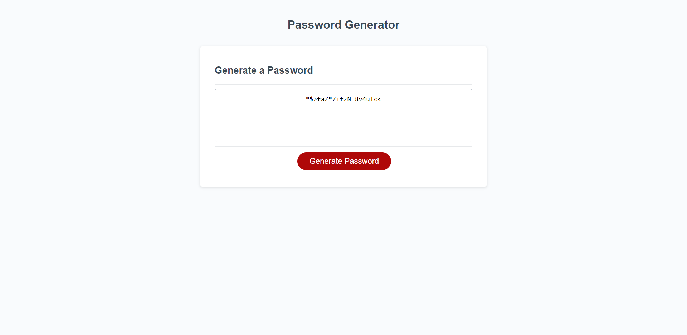

# Title

Password Generated

## Description

As a developer I was tasked with building a Password Generator

- I have added separate arrays that contain Lowercase letters, Uppercase letters, Symbols and Numbers;
- User will be prompted with a message that password must contain between 8 and 128 characters;
- If length condition is not met, user will see a message informing him that the criteria for creating a password does not match the request;
- After choosing a password length between 8 and 128 characters, user will encounter 4 prompts allowing him to choose what type of characters he would like his password to contain (Lowercase, Uppercase, Symbol, Number);
- If user does not confirm any of the character types, he will be prompted with an alert message informing him that he must choose at least one of the character types;
- After user chooses his preferred combination of character types, the password will be generated containing random characters chosen from those specific categories;

## Screenshot of working application

## Link to deployed application

You can access the deployed application [here](https://ttudorandrei.github.io/password_generator/)
You can access the Github repository [here](https://github.com/ttudorandrei/password_generator)
